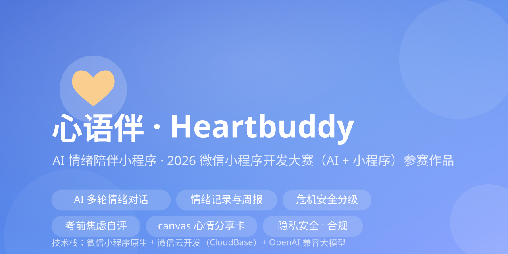
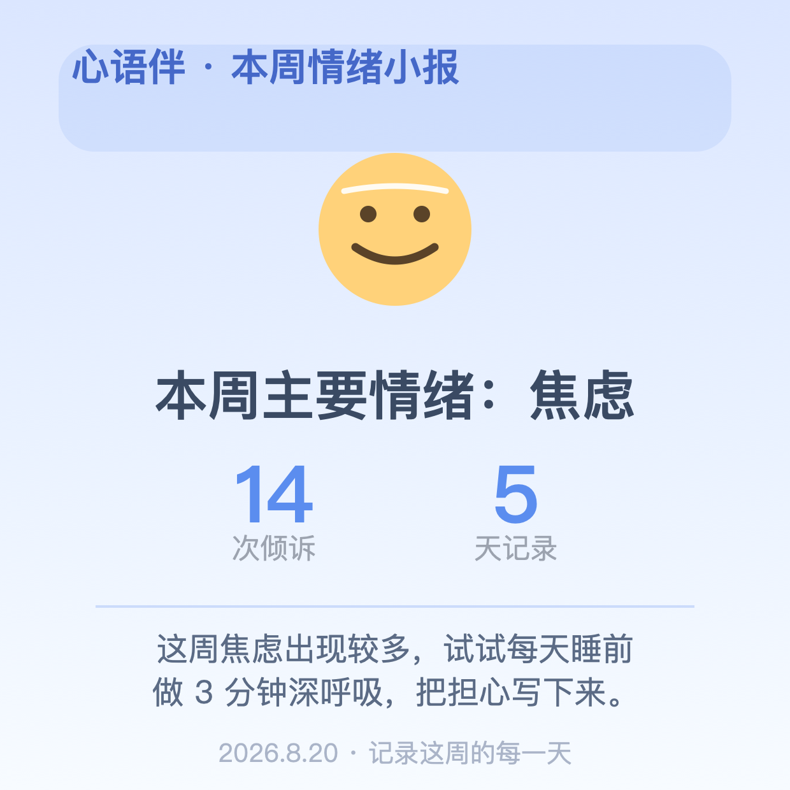
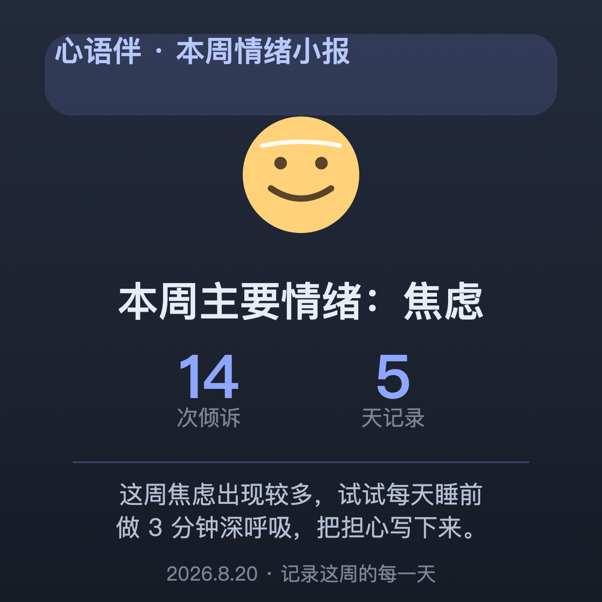
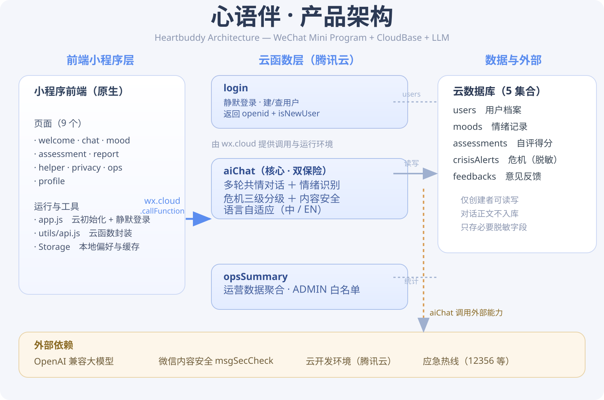
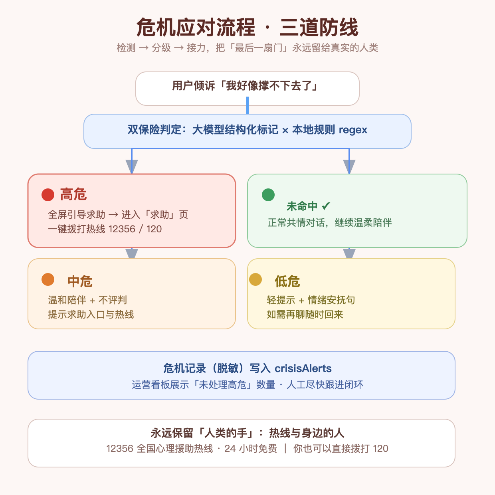

# 心语伴（Heartbuddy）—— AI 情绪陪伴小程序

<p align="center"></p>

> 2026 微信小程序开发大赛参赛作品 · 方向：AI + 心理健康 / 情绪陪伴（学生考前焦虑细分）
> 技术栈：微信小程序原生 + 微信云开发（云函数 / 云数据库）+ OpenAI 兼容大模型
> 🌐 English README → [docs/README-English.md](docs/README-English.md)

## ✨ 功能

| 模块 | 说明 |
|---|---|
| 💬 陪伴 | AI 多轮情绪对话（流式打字机），可标记当前心情、长按复制/珍藏；**首次登录个性化欢迎语** |
| 🌱 心情 | 情绪记录与可视化（8 种情绪+触发来源快选·打卡曲线+健康指数 / 心情日历 / 时光信·已拆开收进「信匣」可回看 / 想法小剧场(念头存7天·到期回看·入库想法盒) / 今日小结(21点后收尾·次日回看)） |
| 📝 周报 | 一键生成「本周情绪小报」+ **月度小结**（构成 Top3 / 与上月对比），含 canvas 分享卡 |
| 📋 自评 | 考前焦虑自评（7 题，GAD-7 风格自编）→ 结果与建议，并自动带入后续 AI 对话上下文 |
| 📊 看板 | 运营数据看板（云函数汇总：用户/倾诉/危机分级/近 7 天记录） |
| 🆘 求助 | 心理援助热线一键拨打 + 危机说明 |
| ⚠️ 危机分级 | 三级响应：high 高危导诊求助页 / mid 温和引导 / low 不打扰，独立落库 |

**危机安全机制**（实现于 `cloudfunctions/aiChat/danger.js`，配合 AI 双保险）：

| 等级 | 分级 | 前端响应 |
|---|---|---|
| 🔴 high | 自伤/自杀等危机表达 | 弹窗 → 一键前往求助页；`crisisAlerts` 落库以 `level=high` |
| 🟠 mid | 绝望 / 撑不下去等强痛苦 | 温和弹窗提示查看求助页 |
| 🟡 low | 一般情绪低落 | 不弹窗，AI 回复里轻提一句

**周报分享卡预览**（运行时 canvas 绘制，浅色 / 深色双模板可切换）：

<p align="center">
  
  
</p>

## 🗺️ 架构总览

<p align="center"></p>

三条链路：**前端 callFunction → 云函数（login / aiChat / opsSummary / opsHandleCrisis / clearMyData）→ 云数据库**；`aiChat` 额外接 **大模型 API**（OpenAI 兼容）与 **微信内容安全 msgSecCheck**。对话正文不进库，库中仅存情绪/测评脱敏字段。

## 🚑 危机应对流程（内置「求助」页）

<p align="center"></p>

三层防线：**双保险检测 → 三级分级 → 记录与真人接力**；危机记录脱敏进 `crisisAlerts`，运营看板可跟进「未处理高危」。

## 🚀 快速开始（约 30 分钟）

> 图文分步教程见 **[docs/部署运维手册.md](docs/部署运维手册.md)**（导入 → 云开发 → 集合 → 云函数 → Key 配置 → 提审 → 日常运维）

### 1. 准备
- 在 [mp.weixin.qq.com](https://mp.weixin.qq.com) 注册小程序，获得 **AppID**
- 下载微信开发者工具（稳定版）

### 2. 打开项目
1. 微信开发者工具 →「导入项目」→ 选择本目录（`heartbuddy-miniprogram/`）
2. 在 `project.config.json` 把 `appid` 改为你的 AppID

### 3. 开通云开发
1. 工具栏点击 **云开发** → 开通（选基础版免费额度即可）
2. 在控制台创建以下**集合**（数据库中）：
   - `users` / `moods` / `crisisAlerts` / `assessments` / `feedbacks`
   - 每个集合权限选择：**「仅创建者可读写」**

### 4. 配置大模型
编辑 `cloudfunctions/aiChat/config.js`：
```js
apiKey: '你的大模型 API Key',
baseUrl: 'https://api.deepseek.com/v1/chat/completions',  // 或混元等 OpenAI 兼容接口
model: 'deepseek-chat',
```
> 推荐：在云开发控制台 → 云函数 → aiChat → 配置 → 环境变量 里配置 `LLM_API_KEY`，而不是写死在代码里。

### 5. 部署云函数
1. 在编辑器中右键 `cloudfunctions/login` → **上传并部署：云端安装依赖**
2. 右键 `cloudfunctions/aiChat` → **上传并部署：云端安装依赖**
3. **（可选）运营看板**：右键 `cloudfunctions/opsSummary` 和 `cloudfunctions/opsHandleCrisis` 同样部署；再把 `opsSummary` / `opsHandleCrisis` 顶部 `ADMIN_OPENIDS` 换成你自己的 openid（可在云开发控制台→用户管理里查）。这样「运营看板」里才能在危机列表上一键把记录标记为已处理
4. **（可选）隐私清空**：右键 `cloudfunctions/clearMyData` 部署后，「我的」页的「清空我的记录」可用
5. 编译运行，完成 🎉

## 🧪 自测清单
- [ ] 首次进入出现「隐私同意」页，同意后可进主页
- [ ] 在「陪伴」页发送消息，AI 流式返回
- [ ] 在「心情」页能看到刚才的情绪记录
- [ ] 「心情」页进入「考前焦虑自评」，答完 7 题出结果
- [ ] 周报页点「生成分享卡片」，能出图并保存到相册
- [ ] 故意输入「我不想活了」**测试用**，应触发求助引导弹窗
- [ ] 「我的」→「运营看板」能看到统计数字（需部署 opsSummary + 填入自己 openid）
- [ ] 在「求助」页点击拨打，能调起系统电话

## 🗂 目录结构
```
heartbuddy-miniprogram/
├── app.js / app.json / app.wxss      # 全局
├── project.config.json               # 工具配置（改 appid）
├── config/index.js                   # 热线与快捷回复
├── utils/api.js                      # 云函数封装
├── pages/
│   ├── welcome/   隐私 & AI 说明 + 首次 3 步新手引导卡(一次性·知道了即收起)
│   ├── chat/        核心对话页（夜间柔和模式(22:00-6:00 自动深色护眼)/快捷情绪双闭环/此刻强度滑条/倾诉后小结算/AI头像情绪态/打字接续草稿/深夜工具箱·写给自己+5分钟急救(固定预案)+睡前托一句话明早回读/📋一键复制整段对话留档/回复引用/长按AI回复「换个说法」重新生成/一键总结这轮对话/长对话折叠·一键收起/连续低落情绪关怀条(可顺手写给此刻的自己)/高危信号首次强调认真对待/自我安抚快捷短句/夸夸我本地词库+和我做3次深呼吸即时引导/撤回我的消息/输入框按时段共鸣占位/英文角/天气/今日心语/晨间轻提醒/计划日提示/重新开始对话/长按珍藏·含撤回/今日第  N 次倾诉徽章/陪伴身份(朋友/树洞/清醒教练·本地记住)/陪伴里程碑(111·333·999句)/底栏已聊几 句·写字数计数）
│   ├── mood/      情绪可视化（快速记录(强度1-5可选·默认3)/记录里程碑庆祝(第10/50/100/200条一次性)/8种心情/健康指数/14天洞察(色带14/30天⇄切换)·连低连高解读·曲线今日锚点/色带点天小结+写一句补记+长按管理/日历+翻月回本月·本月触发来源排行/今日未记录轻提醒/未打卡可一键回顶部记录/健康指数❓说明·本月记录天数徽章·情绪断崖预警/三件小事(💡灵感一键填入)·全完成庆祝/记录后暖心回应+负性情绪「情绪急救包」(3件即时小事·一键去呼吸/充电站)·分布一句话解读/最像此刻的一天回看/时光信）
│   ├── assessment/ 考前焦虑自评 + 应对卡 + 分享给信任的人(脱敏复制) + 逐题洞察 + 历史波动提醒 + 3 天陪伴计划 + 距上次测评轻提醒 + 结果页引导·去充电站 + 高分就医指引 + 3天后复查提醒·到期pink强调+立即重测
│   ├── ops/       运营看板（危机闭环/本周与月度处理率/月度对比行/累计用户·今日新增用户·7日活跃/今日新增危机快报/用户反馈流·点开全文/CSV+一键复制运营摘要/7日均值快照/来源分布/高危趋势+24h回访闭环/高危处理率近7日趋势/危机平均处理时长(本月均值+中位数)/高危用户带最近高危时间/高危24小时时段分布/高危清单一键复制脱敏列表/高危一键转督办单(12/24/48h+备注)/待回访督办单看板·复制完整跟进清单/反馈一键标记已回应+全部批量/修复）
│   ├── report/    周报 + 月度小结（Top3/上月对比/平均强度/情绪词云·📋一键复制月度小结可发老师家长）+ 本周情绪构成彩带(堆叠条+图例·观察不评判)+ 连续低日提醒 + 正向鼓励条 + 一句话状态总结 + 本周相对最好的一天 + 本周练习足迹 + 文字版含练习足迹 + 本周平均强度 + 本周对自己说备注 + 近4周记录节奏 + canvas 分享卡
│   ├── helper/    求助（热线/安全包·我提前信任的人名单(支持存电话·危急一键拨打)/1h·24h·3d·7d四段温暖回访/走完四段一次性「毕业卡」致谢/回访关怀卡/求助后静音关怀/智能分流提示/「现在最需要什么」三方向快速分流/呼吸·扫描快捷直达卡/「我撑过来了」5步·进度存档续走/开口求助话术生成器(5种处境→生成第一句话·可复制/换说法)+考试季家长贴士一键复制转发/一键复制求助文字发信任的人/今日关怀/英语角）
│   ├── breathe/   呼吸放松练习（4 轮引导/4 档节奏 4-4-6·4-4-4-4·6-2-6-2+发呆2分钟+自定义节奏(吸/屏/呼 2-10 秒可调·本地保存)+按时段推荐节奏(晨盒式/午放松/夜长呼)·结束可选 1-5 强度记录平静/呼吸徽章/累计+本周进度统计·每日 10 分钟目标进度条+达标连击+近4周放松热力图+最近7次放松回看·完成练习「呼吸回响」(→直达心理小课·为什么呼吸有用)，全程本地）
│   ├── scan/      5 分钟身体扫描（10 段引导计时·完成自动记「平静」+可选 1-5 强度+身体感受一词(松了/暖了…留最近5次回看)/累计完成次数/再来一次/每日一句轮换开场）
│   ├── station/   情绪充电站（10 张可展开心理急救卡(含拖延启动式·睡前两行清单·发呆 2 分钟·气得发抖时 60 秒降火·5-4-3-2-1接地术)/一键跳呼吸·聊天·记下此刻心情·「🎴随机抽一张」·卡片长按★收藏置顶(最多3张)·入口「心理小课」/可分享·今日一句话(换日轮换)）
│   ├── edu/       心理小课（7 节心理健康小课程·本地：认识情绪/考前焦虑/睡不着/低落最小行动/朋友闹掰/社媒比较心/向大人求助不丢人·每课「随堂一问」答对自动点亮·完成度进度条·🔥连续学习天数·一键重置·热线直达）
│   ├── privacy/   隐私政策（全文）
│   └── profile/   我的（数据足迹含心理小课进度条直达/成就徽章×14(🎓小学霸·学完心理小课7节)/今日心情卡(Canvas生成·可保存分享)/导出数据+「数据都放在哪」透明说明/数据足迹+月均强度·常用入口+本月练习计数(呼吸/扫描/写给自己)/珍藏可一键复制全部/按时段日签问候+累计陪伴天数·最近自评直达/好久没回温柔卡）
├── assets/banner.svg                  # README 封面
├── assets/sharecard-preview.png       # 周报分享卡预览-浅色（.svg 生成）
├── assets/sharecard-preview-dark.png  # 周报分享卡预览-深色（.svg 生成）
├── assets/architecture.svg            # 产品架构图（README 内嵌）
├── assets/crisis-flow.svg/.png        # 危机应对流程图（SVG + 真机 PNG）
├── docs/视频脚本.md                    # 参赛演示视频分镜脚本
├── docs/演示录屏分镜卡.md              # 按镜头可拍的录制卡（S1–S10）
├── docs/演示视频逐句稿.md              # 口播 + 字幕逐字稿（S1–S10）
├── docs/参赛提交自查清单.md             # 提交前逐项打勾
├── docs/竞赛提交包核对单.md            # 源码/视频/文档/配置 单张汇总
├── docs/答辩问答预判.md                # 评委 10 问 Q&A
├── docs/部署运维手册.md                # 部署/集合/Key/提审/运维/排障
├── docs/部署运维手册-en.md            # 部署运维英文精简版（国际评委）
├── docs/评委体验口令卡.md             # 评委 3 分钟走 3 条路径（路演/答辩用）
├── tools/accessibility-check.py       # 无障碍自检脚本（本地 python3 运行）
├── tools/chart-check.js                # 制图布局单测（node 运行，已入 CI）
├── components/emotion-chart/          # 通用 Canvas2D 折线图（footer/长按/保存按钮，mood/ops 复用）
├── components/crisis-flow/            # 危机流程图组件（点击全屏/长按另存）
├── components/share-card/             # 周报分享卡组件（浅/深双模板，长按预览/保存）
├── utils/moodscore.js                 # 情绪→分值映射（mood/ops 共享）
├── utils/chart-model.js               # 折线图布局纯函数（组件 + CI 单测共用）
├── docs/周报分享图文教程.md            # 生成分享卡 → 朋友圈 4 步图文教程
├── docs/README-English.md            # 英文版 README
├── .github/workflows/check.yml        # CI：JS/JSON/SVG + 制图布局单测自动校验
└── cloudfunctions/
    ├── login/     静默登录（建 users 记录）
    ├── aiChat/    对话 + 情绪 + 危机（config / prompt / danger）
    ├── opsSummary/ 数据汇总（填 ADMIN_OPENIDS 白名单）
    ├── opsHandleCrisis/ 危机一键闭环（标记已处理，同白名单）
    └── clearMyData/ 隐私合规：清空当前用户数据
```

## 🔒 合规注意
- 定位为「情绪陪伴」，**不出现「诊断 / 治疗 / 咨询机构」等医疗属性用语**
- 对话需在隐私同意后使用；敏感语已做危机分流
- 已内置《隐私政策》页（`pages/privacy`）与欢迎页《用户须知与免责声明》；上线前再复核：内容安全过滤、热线号码（12356 / 400-161-9995）实际接通
- 代码中 LLM Key 务必走环境变量，不提交到仓库

## 🧩 开源结合（可选进阶）
- 对话 UI 可二次开发「[腾讯云开发 Agent UI](https://github.com/TencentCloudBase/cloudbase-agent-ui)」（Apache-2.0），替换自绘气泡
- 心理量表结构可参考「[为之易心理健康系统 wzy-xl](https://github.com/bonyren/wzy-xl)」（注意其 License 与量表版权）
- 中文共情提示词可参考「[MeChat 数据集](https://huggingface.co/qiuhuachuan/MeChat)」

## 📄 License
本项目为参赛 demo，仅供学习与参赛使用；若引用第三方开源组件，请遵守各自协议。